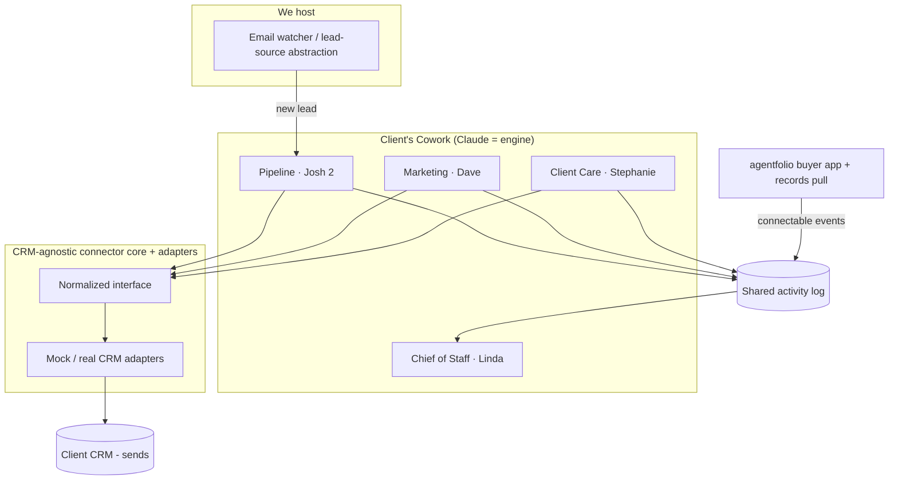

# Implementation Plan — Clockwork §8 First Build

## Problem Statement

Build the lightest path to a sellable, dogfoodable Clockwork install: the robots
that are already Claude-native and need only a CRM connector — Marketing (Dave),
Chief of Staff (Linda), Client Care curation (Stephanie) — plus the agentfolio
buyer side (greenfield) and the priority email speed-to-lead trigger (Pipeline /
Josh 2's instant response). Everything gated on MLS/records or Transaction
privacy is deferred to follow-on installs.

## Requirements

- Scope: §8 first build only.
- CRM-agnostic core + thin adapters from day one; no specific CRM locked (Rechat
  possible later, not a constraint now).
- The 4 existing skills live only in Joe's Cowork — treated as black-box logic
  Joe owns, not code Kevin reads or rebuilds. Kevin's work is wiring, connectors,
  the watcher, agentfolio, and packaging.
- The always-on email watcher is hosted by us; a recommendation is wanted on the how.
- agentfolio buyer side is greenfield: prototype-first, then productize.
- The §5 hosting + maintenance tradeoff is a real deliverable with a recommendation.
- Compliance posture: Claude drafts, the client's CRM sends; still honor
  disclosed-AI + consent. agentfolio needs agent-private vs client views.
- Personas are client-renamable: Joe's roster names (Josh 2, Dave, Stephanie,
  Linda, etc.) are defaults, and each client can override them. The configured
  name flows through drafted-message voice/signature, the activity log, and the
  Chief of Staff dashboard — no hardcoded persona names.

## Background (research findings + assumptions)

- **Engine.** Claude runs in the client's own Cowork. Robots = a skill (logic) +
  a scheduled task (cadence) + connectors (CRM/MLS/data). Sending is drafts-in /
  CRM-sends-out, so delivery inherits the CRM's compliance. *Assumption to confirm
  in Joe's Cowork: how scheduled tasks fire, how connectors are registered (MCP),
  and how a skill is packaged for install.*
- **Speed-to-lead.** "Instant" means latency-sensitive, so the hosted watcher
  should call Claude directly (Anthropic API with the Pipeline logic) rather than
  wait on a scheduled task, then route the draft to the CRM's send API. Watcher
  options: Gmail API push via Pub/Sub, Microsoft Graph subscriptions, or IMAP
  polling as a fallback. If a client's leads land in the CRM instead of email, the
  same trigger listens on a CRM webhook — so "lead source" should be an abstraction.
- **agentfolio.** A real web app (can't be "just Claude"). Buyer side = shared
  agent↔client board with auto public-records pull (Joe's existing ACRIS pattern
  points to NYC first). Default stack pick: a TypeScript web app (Next.js/React) +
  Postgres + a records-source abstraction with an ACRIS adapter first. It stays
  connectable so its actions can run through the Chief of Staff + robots.
- **Security flags.** The watcher needs OAuth access to a client inbox, and
  agentfolio holds PII and an agent-private view — both need real auth/access
  control from the start, not bolted on later.

## Proposed Solution

A CRM-agnostic connector core is the spine. The hosted email watcher + Pipeline
instant-response proves the speed-to-lead loop end-to-end against a mock CRM.
Marketing and Client Care wire Joe's existing skills to the same connector on a
cadence. A shared activity log lets the Chief of Staff produce a daily synthesis
brief and oversight dashboard from the other robots' output. agentfolio's buyer
side is built in parallel as its own app, then given a connectable hook into the
Chief of Staff. We validate against one real CRM adapter, then package the whole
thing as a repeatable per-client install following the hosting recommendation.

## Task Breakdown

- [x] **Task 1: agentfolio hosting + maintenance recommendation (the §5 deliverable).**
  Objective: produce a decision memo comparing (a) deploy-an-instance-into-the-client's-hosting-and-hand-over
  vs. (b) we-host-as-the-one-ongoing-piece, with a realistic maintenance-load
  estimate and a recommendation. Guidance: cover operational upkeep (updates,
  monitoring, data/records-feed refresh, support load), cost shape, and the tension
  with "we don't run it"; note implications for the email watcher (which we're
  already hosting). Tests: n/a (written deliverable); include explicit decision
  criteria so it's checkable. Demo: a short memo Joe can read, ending in a clear
  recommendation that sets the infra direction for Tasks 5 and 10.

- [x] **Task 2: Project scaffold, CI, and test harness.**
  Objective: stand up the repo structure (connector core, watcher service,
  agentfolio app as separate packages), linting, and a green CI pipeline with a
  sample passing test. Includes a per-client config module with a persona registry:
  each robot's display name defaults to Joe's roster and is client-overridable, read
  from one place so no persona name is hardcoded. Guidance: pick the default stacks
  (TS for app/watcher), add secrets management from day one. Tests: a trivial unit
  test, a health-check test, and a persona-config test (default resolves to roster,
  override wins). Demo: CI runs green on a push; a health endpoint responds locally;
  overriding a persona name in config changes what the resolver returns.

- [x] **Task 3: CRM-agnostic connector core + mock adapter.**
  Objective: define the normalized interface (create/lookup contact, send message
  via CRM, fetch new leads, log activity) and ship a mock adapter, exposed as a
  tool Claude can call. Guidance: keep adapters thin behind the core; design for
  swap-in real adapters later. Tests: unit tests per interface method against the
  mock; contract tests the real adapters will reuse. Demo: drive all four
  operations against the mock via tests and a single tool call.

- [x] **Task 4: Shared activity log / event store.**
  Objective: a simple append-and-query store where every robot records what it did.
  Guidance: normalized event shape (who/what/when/contact/outcome); this becomes
  the Chief of Staff's feed. Tests: write/query/round-trip tests. Demo: write
  sample events from two sources and query them back filtered by robot and date.

- [x] **Task 5: Email speed-to-lead watcher (detection only).**
  Objective: the always-on, hosted watcher detects a new-lead email and emits a
  normalized lead event via the lead-source abstraction. Guidance: implement one
  provider first (Gmail push or Graph), OAuth scopes least-privilege, fallback to
  IMAP poll; design so a CRM webhook can be a drop-in lead source. Tests: given a
  sample lead email, assert a correctly parsed lead event; auth/error-path tests.
  Demo: send a test lead email → watcher emits a normalized lead (no response yet).

- [ ] **Task 6: Pipeline instant-response — close the speed-to-lead loop.**
  Objective: on a lead event, call Claude (Pipeline logic) to draft an instant
  reply, send it via the connector (mock adapter), log to the activity log, with
  disclosed-AI + consent handling. Guidance: latency-sensitive path; keep
  human-in-the-loop optional/configurable. Tests: end-to-end test (email in →
  drafted reply → mock send → logged event), including the disclosure/consent check.
  Demo: a test lead email triggers an instant drafted response "sent" via the mock
  CRM and visible in the activity log.

- [ ] **Task 7: Marketing robot (Dave) wiring.**
  Objective: package Joe's existing newsletter/personal-sends skills with a
  scheduled cadence and sphere send through the connector. Guidance: treat Joe's
  skill as black-box logic; Kevin owns the cadence + connector + logging. Tests:
  scheduled run produces a draft and routes a sphere send to the mock adapter;
  logged. Demo: trigger Marketing → newsletter drafted → sent to a test sphere via
  the mock CRM, recorded in the log.

- [ ] **Task 8: Client Care curation (Stephanie) wiring.**
  Objective: wire sphere rotation + anniversaries/life-events sends through the
  connector on a cadence; explicitly stub the home value report (records-gated,
  deferred). Guidance: reuse the cadence + connector + logging patterns from
  Task 7. Tests: a scheduled run surfaces due touches, drafts, and sends via the
  mock adapter; assert the report path is a clean no-op stub. Demo: a scheduled
  Client Care run surfaces due touches and sends them via the mock CRM, logged.

- [ ] **Task 9: Chief of Staff (Linda) daily synthesis brief + oversight dashboard.**
  Objective: a scheduled task that reads the activity log (and connector data) to
  produce a daily brief artifact and an oversight view across the running robots.
  Guidance: synthesis is Claude-native; Kevin supplies the feeds and the
  artifact/dashboard surface. Tests: given seeded activity from Tasks 6–8, assert
  the brief summarizes pipeline/marketing/client-care activity correctly, and that
  the brief and dashboard display each robot by its configured persona name. Demo:
  after the other robots run, Linda produces a daily brief + oversight dashboard
  summarizing their activity.

- [ ] **Task 10: agentfolio buyer board (data, auth, views).**
  Objective: greenfield buyer side — data model and board (properties, stages
  new/touring/offer/passed, tours, notes, comments) with auth and agent-private vs
  client views. Guidance: build to the hosting decision from Task 1; access control
  is a first-class requirement. Tests: model/CRUD tests plus an access-control test
  proving client view can't see agent-private fields. Demo: an agent creates a
  board, adds a property, moves it through stages; the client sees only the client view.

- [ ] **Task 11: agentfolio public-records pull.**
  Objective: a records-source abstraction with an ACRIS (NYC) adapter that
  auto-pulls owner/deeds/mortgage/tax/building on add. Guidance: mirror the
  connector-core pattern (agnostic core + thin adapter) so other markets slot in
  later. Tests: adapter unit tests against sample ACRIS responses; integration test
  for add-property → records populated. Demo: add a property → public records
  auto-populate on the card.

- [ ] **Task 12: agentfolio transaction-room handoff + connectable hook.**
  Objective: a transaction-room handoff (stub the room itself) and a connectable
  event hook so agentfolio actions land in the shared activity log for the Chief of
  Staff. Guidance: this is the "sold separately but connectable" wiring. Tests:
  moving a property to offer/handoff emits an event the activity log captures and
  Linda's brief can read. Demo: move a property to handoff → the event shows up in
  the Chief of Staff feed.

- [ ] **Task 13: First real CRM adapter.**
  Objective: implement the agnostic interface against one real CRM sandbox (e.g.,
  Rechat or the first client's CRM) and swap mock → real behind a config flag.
  Guidance: reuse the Task 3 contract tests unchanged. Tests: contract tests pass
  against the real adapter; the speed-to-lead, Marketing, and Client Care flows run
  against the real sandbox. Demo: the same three flows run end-to-end against a real
  CRM, sending through it.

- [ ] **Task 14: Install packaging + per-client config + handover.**
  Objective: turn the pieces into a repeatable per-client install — config/secrets
  per client (including persona-name overrides for each robot), the lean front-door
  audit/install checklist (salvaged from the v3 appendix), and deployment of the
  hosted watcher + agentfolio per Task 1's recommendation. Guidance: this is the
  "sell-the-setup" deliverable; everything built so far gets wired into one install
  flow with a smoke test. Tests: a clean install onto a fresh environment from the
  checklist, ending in an end-to-end smoke test (lead email → response; cadence
  send; daily brief; agentfolio board live), including a custom persona name set at
  install and showing up in a draft + the dashboard. Demo: a from-scratch install producing a working Clockwork setup for a new
  client.

## Notes

- Task 1 (hosting recommendation) is sequenced first because it sets the infra
  direction for both the watcher and agentfolio.
- Security touchpoints (inbox OAuth scopes, agentfolio agent-private views, secrets)
  are baked into the relevant tasks rather than deferred.
- Tuning options for a later pass: reorder so the speed-to-lead demo (Tasks 3–6)
  lands before agentfolio for an earlier sellable moment, or pull agentfolio
  (Tasks 10–12) to the front if that's the stronger sales artifact for Joe.
